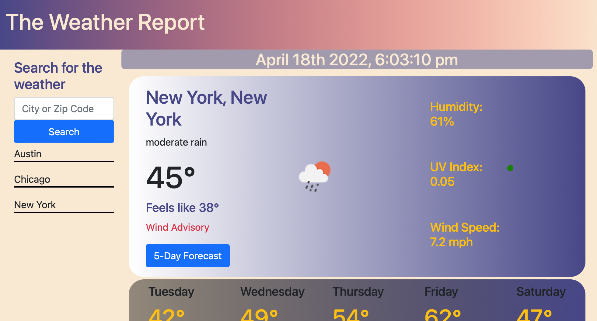

# 06-Homework
## by William Wong
### The Weather Report Website
### Site viewable here: https://billycwong19.github.io/06-Homework/
#### The Weather Report was a tough one for me. I got caught up in a lot of functionality quirks and found a lot of bugs and kept churning through the mud. I did find a good stopping point, and I'm happy with the result, but there are bugs still, and if I kept going I would have done way more than what was necessary for the assignment. I had fun at first, but then I realized I bit off way more than I could chew. So, I think perhaps a more strategic approach next time will help me sift through code better.
###### 